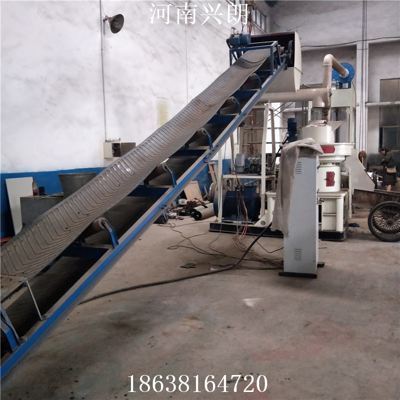

## 主要目的

家里想搞一台颗粒粉碎机，用来加工木材赚钱。

###  简介

木屑颗粒机是生物质新能源设备，是木屑颗粒生产的制粒设备；以桉木、桦木、杨木、果木、竹屑及农作物秸杆等为原料，通过粉碎、烘干、筛选、制粒、冷却、打包等过程制作成品木屑颗粒。其成品使用在生物质发电、锅炉、壁炉、家用设备等。 

### 原料

生物质颗粒的原料来源非常广泛，以木材加工和人造板生产中产生的锯屑、刨花、树皮、砂光粉、废旧木材、枝丫材；农作物收获后产生的各类秸秆；其它各类可燃烧的生物质为原料，不需要添加任何胶粘剂，通过设备加工处理，均可制造生物质颗粒燃料。 

### 销路

1. 卖给本地的湘钢

2. 卖给本地的槟榔厂，这两个主要是用木料颗粒坐燃料烧

3. 淘宝开店，做花肥或者宠物垫料，如下图

   

### 淘宝价格

1. 大量购买当燃料用的，800-900一吨，好的红木做的，可以一千多一吨
2. 做宠物木屑，基本会很赚，但是要看小路，可以一斤几块钱。如上图这样价格。

### 厂家

1. **河南巩义市三利重型设备厂：**

   木屑颗粒机制粒机 木屑颗粒机厂家 1T木屑颗粒机制粒机生产线

   [淘宝链接](https://item.taobao.com/item.htm?id=559652230867&ali_refid=a3_430582_1006:1151363887:N:%E6%9C%A8%E5%B1%91%E9%A2%97%E7%B2%92%E6%9C%BA:e62e2366e712691947e38b2a928d4cf9&ali_trackid=1_e62e2366e712691947e38b2a928d4cf9&spm=a230r.1.14.1#detail)

   价格：85000，运输过来：90000

   图片：

   

   产量：每小时一顿

   视频：

   <video width="320" height="240" controls> <source src="./video/gongyi1.mp4" type="video/mp4">您的浏览器不支持 video 标签。 </video> 

   <video width="320" height="240" controls> <source src="./video/gongyi2.mp4" type="video/mp4">您的浏览器不支持 video 标签。 </video> 

2. **广州平民机械设备：**

   中大型木屑颗粒机平模生物质颗粒机生物燃烧颗粒机锯末木屑制粒机

   [淘宝链接](https://item.taobao.com/item.htm?spm=a230r.1.14.16.28d3354eYPBcrG&id=546158615606&ns=1&abbucket=11#detail)

   价格：2-3万

   产量：如下图

   

   视频：

   <video width="320" height="240" controls> <source src="./video/guangzhou1.mp4" type="video/mp4">您的浏览器不支持 video 标签。 </video> 

   <video width="320" height="240" controls> <source src="./video/guangzhou2.mp4" type="video/mp4">您的浏览器不支持 video 标签。 </video> 

3. **江苏鸿舜 880大型:**

   [淘宝链接](https://item.taobao.com/item.htm?spm=a230r.1.14.16.61de3493oBouWM&id=564949674497&ns=1&abbucket=11#detail)

   厂家生产880锯末颗粒机 木屑颗粒机 大型生物质锯末颗粒机

   价格：55万

   

4. **河南兴郎机械设备公司：**

   [淘宝链接](https://item.taobao.com/item.htm?spm=a230r.1.14.21.46dc3493JP0BKJ&id=570377222777&ns=1&abbucket=11#detail)

   厂家生产880锯末颗粒机 木屑颗粒机 大型生物质锯末颗粒机

   价格：58000（存疑，不确定是不是真实价格）

   

   

   

5. **宇龙机械：**

   地址：http://www.yulongjixie.cn/products/keliji-2015110126.html

   

   

   <video class="dplayer-video dplayer-video-current" webkit-playsinline="" playsinline="" preload="metadata" src="blob:http://www.yulongjixie.cn/a15c6497-038b-4de2-82d6-28330de0ca6d"></video>